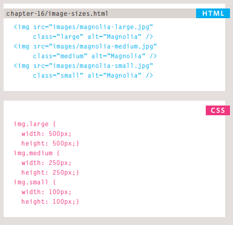
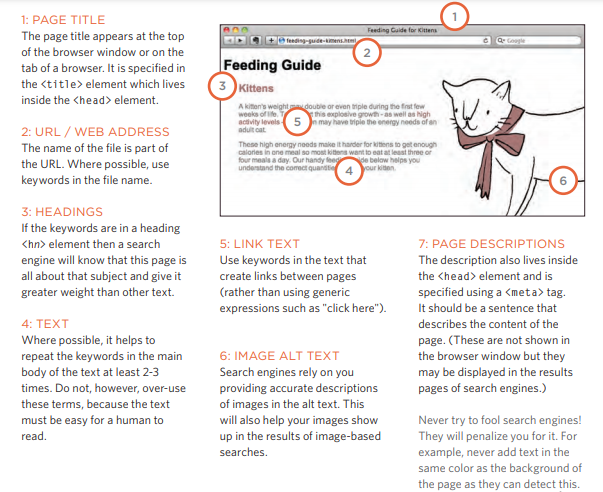

# IMAGES

## Controlling sizes of images in CSS

You can control the size of an image using the width and height properties in CSS, just like you can for any other box. Specifying image sizes helps
pages to load more smoothly because the HTML and CSS code will often load before the images, and telling the browser how much space to leave for an image allows it to render the rest of the page without waiting for the image to download.

## Centering images Using CSS

By default, images are inline elements. This means that they flow within the surrounding text. In order to center an image, it should be turned into a blocklevel element using the display property with a value of block.

Once it has been made into a block-level element, there are two common ways in which you can horizontally center an image:

1. On the containing element, you can use the text-align property with a value of center.

2. On the image itself, you can use the use the margin property and set the values of the left and right margins to auto.

# Summary IMAGES

1. You can specify the dimensions of images using CSS. This is very helpful when you use the same sized images on several pages of your site.
2. Images can be aligned both horizontally and vertically using CSS.
3. You can use a background image behind the box created by any element on a page.
4. Background images can appear just once or be repeated across the background of the box.
5. You can create image rollover effects by moving the background position of an image.
6. To reduce the number of images your browser has to load, you can create image sprites.

# Practical Information

## Search Engine Optimization (SEO)

- SEO is a huge topic and several books have been written on the subject.
The following pages will help you understand the key concepts so you can
improve your website's visibility on search engines.

## On-Page SEO

In every page of your website there are seven key places where keywords
(the words people might search on to find your site) can appear in order
to improve its findability.

