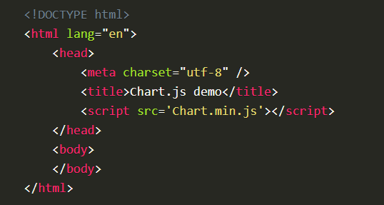
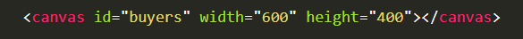
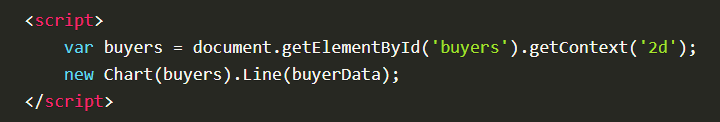
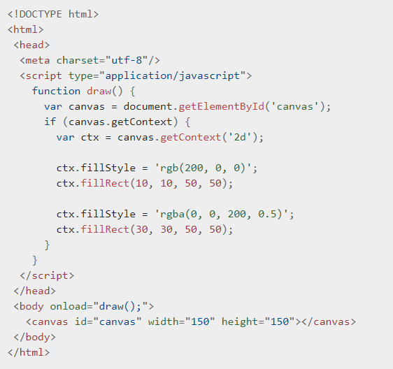

#  Chart
Charts are far better for displaying data visually than tables and have the added benefit that no one is ever going to press-gang them into use as a layout tool. They’re easier to look at and convey data quickly, but they’re not always easy to create.

##  Setting up
The first thing we need to do is [download Chart.js](https://github.com/chartjs/Chart.js). Copy the Chart.min.js out of the unzipped folder and into the directory you’ll be working in. Then create a new html page and import the script:

## Drawing a line chart
To draw a line chart, the first thing we need to do is create a canvas element in our HTML in which Chart.js can draw our chart. So add this to the body of our HTML page:

Next, we need to write a script that will retrieve the context of the canvas, so add this to the foot of your body element:

# Creating a Chart

## Required </ canvas> tag
As a consequence of the way fallback is provided, unlike the < img> element, the < canvas> element requires the closing tag ( < /canvas>). If this tag is not present, the rest of the document would be considered the fallback content and wouldn't be displayed.

If fallback content is not needed, a simple < canvas id="foo" ...></ canvas> is fully compatible with all browsers that support canvas at all.

## Example 

