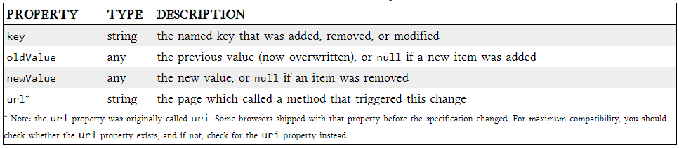

# local storage

ersistent local storage is one of the areas where native client applications have held an advantage over web applications. For native applications, the operating system typically provides an abstraction layer for storing and retrieving application-specific data like preferences or runtime state. These values may be stored in the registry, INI files, XML files, or some other place according to platform convention. If your native client application needs local storage beyond key/value pairs, you can embed your own database, invent your own file format, or any number of other solutions.

Historically, web applications have had none of these luxuries. Cookies were invented early in the web’s history, and indeed they can be used for persistent local storage of small amounts of data. But they have three potentially dealbreaking downsides:

1. Cookies are included with every HTTP request, thereby slowing down your web application by needlessly transmitting the same data over and over

2. Cookies are included with every HTTP request, thereby sending data unencrypted over the internet (unless your entire web application is served over SSL)

3. Cookies are limited to about 4 KB of data — enough to slow down your application (see above), but not enough to be terribly useful

## What we really want is

- a lot of storage space
- on the client
- that persists beyond a page refresh
- and isn’t transmitted to the server

## what is HTML5 Storage?

 Simply put, it’s a way for web pages to store named key/value pairs locally, within the client web browser. Like cookies, this data persists even after you navigate away from the web site, close your browser tab, exit your browser, or what have you. Unlike cookies, this data is never transmitted to the remote web server (unless you go out of your way to send it manually). Unlike all previous attempts at providing persistent local storage, it is implemented natively in web browsers, so it is available even when third-party browser plugins are not.

 

 ##  USING HTML5 STORAGE

 HTML5 Storage is based on named key/value pairs. You store data based on a named key, then you can retrieve that data with the same key. The named key is a string. The data can be any type supported by JavaScript, including strings, Booleans, integers, or floats. However, the data is actually stored as a string. If you are storing and retrieving anything other than strings, you will need to use functions like parseInt() or parseFloat() to coerce your retrieved data into the expected JavaScript datatype.

 

 ##  STORAGEEVENT OBJECT

 