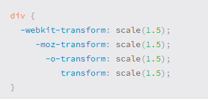
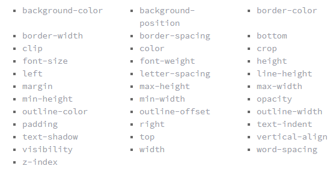

# CSS Transforms, Transitions, and Animations

## Transforms

With CSS3 came new ways to position and alter elements. Now general layout techniques can be revisited with alternative ways to size, position, and change elements. All of these new techniques are made possible by the transform property.

The transform property comes in two different settings, two-dimensional and three-dimensional. Each of these come with their own individual properties and values.

- Transform Syntax

# 2D Transforms

1. 2D Rotate
2. 2D Scale
3. 2D Skew

- If you want to laren more of this thing [click hear](https://learn.shayhowe.com/advanced-html-css/css-transforms/)

# Transitions & Animations

# Transitions
As mentioned, for a transition to take place, an element must have a change in state, and different styles must be identified for each state. The easiest way for determining styles for different states is by using the :hover, :focus, :active, and :target pseudo-classes.

There are four transition related properties in total, including transition-property, transition-duration, transition-timing-function, and transition-delay. Not all of these are required to build a transition, with the first three are the most popular.

## Transitional Properties

It is important to note, not all properties may be transitioned, only properties that have an identifiable halfway point. Colors, font sizes, and the alike may be transitioned from one value to another as they have recognizable values in-between one another.
 The display property, for example, may not be transitioned as it does not have any midpoint. A handful of the more popular transitional properties include the following.

 

## Transition Duration

The duration in which a transition takes place is set using the transition-duration property. The value of this property can be set using general timing values, including seconds (s) and milliseconds (ms). 

# Animations

Transitions do a great job of building out visual interactions from one state to another, and are perfect for these kinds of single state changes. However, when more control is required, transitions need to have multiple states. In return, this is where animations pick up where transitions leave off.

## Animations Keyframes

To set multiple points at which an element should undergo a transition, use the @keyframes rule. The @keyframes rule includes the animation name, any animation breakpoints, and the properties intended to be animated.

- If you want to laren more of this thing [click hear](https://learn.shayhowe.com/advanced-html-css/transitions-animations/)
