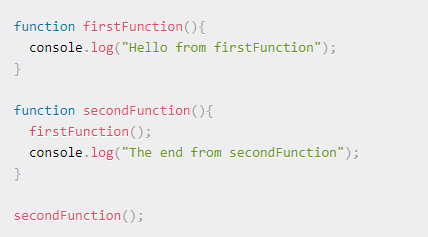

# Understanding the JavaScript Call Stack

1. What is a ‘call’? a call stack is a data structure that uses the Last In, First Out (LIFO) principle to temporarily store and manage function invocation (call).

2. What does LIFO mean? LIFO: When we say that the call stack, operates by the data structure principle of Last In, First Out, it means that the last function that gets pushed into the stack is the first to be pop out, when the function returns

3. What causes a Stack Overflow? A stack overflow occurs when there is a recursive function (a function that calls itself) without an exit point. The browser (hosting environment) has a maximum stack call that it can accomodate before throwing a stack error.

4. Draw an example of a call stack and the functions that would need to be invoked to generate that call stack.

5. What causes a Stack Overflow? 
A stack overflow occurs when there is a recursive function (a function that calls itself) without an exit point. The browser (hosting environment) has a maximum stack call that it can accomodate before throwing a stack error.

# JavaScript error messages

1. What is a refrence error? It’s means that when you try to use a variable that is not yet declared you get this type os errors.

2. What is a syntax error? It’s means when you have something that cannot be parsed in terms of syntax.

3. What is a range error? It’s means when you invalid length to an object with some kind of length.

4. What is a tyep error? It’s means when the types number, string ..... you are trying to use or access are incompatible.

5. What is a breakpoint? It’s means putting a debugger statement in your code in the line you want to break.

6.  What does the word debugger do in your code? Debugging is the process of detecting and removing of existing and potential errors in the code by using the console.log() the variables you want to check.