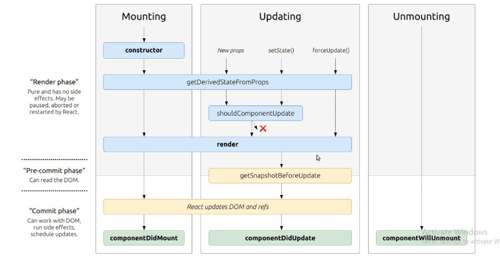
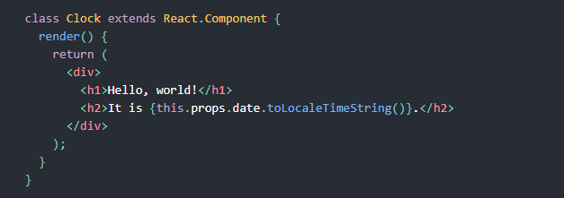
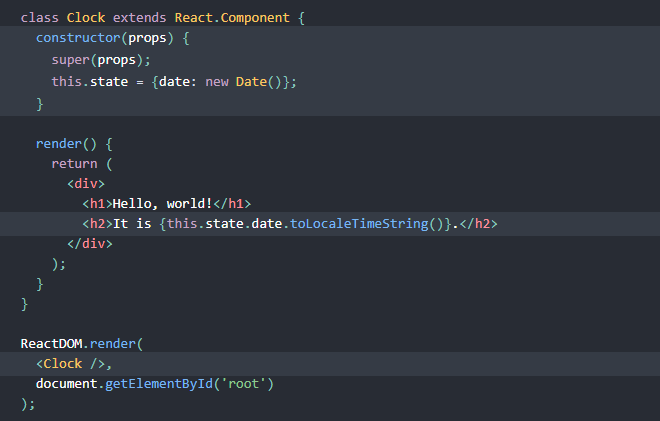

# React: Component Lifecycle Events

## What are component lifecycle events?

React lets you define components as classes or functions. The methods that you are able to use on these are called lifecycle events. These methods can be called during the lifecycle of a component, and they allow you to update the UI and application states.

## React State Vs Props

1. What types of things can you pass in the props?

Props ("properties") in React allows us to pass values from a parent component down to a child component. The values can be any data type, from strings to functions, objects.

2. What is the big difference between props and state?

**Props** allow you to pass data from one component to other components as an argument.
**State** holds information about the components.

3. When do we re-render our application?

React components automatically re-render whenever there is a change in their state or props. A simple update of the state, from anywhere in the code, causes all the User Interface (UI) elements to be re-rendered automatically.

4. What are some examples of things that we could store in state?

The current best practice is to use local state to handle the state of your user interface (UI) state rather than data. For example, using a controlled component to fill out a form is a perfectly valid use of local state.

Another example of UI data that you could store in local state would be the currently selected tab from a list of options.

A good way to think about when to use local state is to consider whether the value you’re storing will be used by another component. If a value is specific to only a single component (or perhaps a single child of that component), then it’s safe to keep that value in local state.

## Converting a Function to a Class

You can convert a function component like Clock to a class in five steps:

- Create an ES6 class, with the same name, that extends React.Component.
- Add a single empty method to it called render().
- Move the body of the function into the render() method.
- Replace props with this.props in the render() body.
- Delete the remaining empty function declaration.

## Adding Local State to a Class

1. Replace this.props.date with this.state.date in the render() method
2. Add a class constructor that assigns the initial this.state
3. Remove the date prop from the < Clock /> element

The result looks like this:

## IF YOU WANT TO KNOW MORE ABOUT THIS YOU SHOULD VISIT THESE LINKS

 [React Docs - handling events](https://reactjs.org/docs/handling-events.html)
 [React Tutorial through ‘Developer Tools’](https://reactjs.org/tutorial/tutorial.html)
