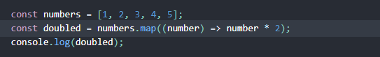
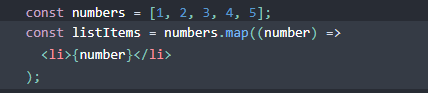
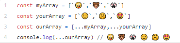
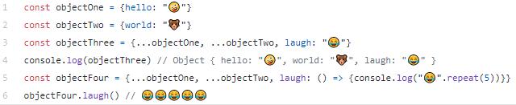

# lists and keys

1. What does .map() return?
Given the code below, we use the map() function to take an array of numbers and double their values. We assign the new array returned by map() to the variable doubled and log it.

2. If I want to loop through an array and display each value in JSX, how do I do that in React?
 we loop through the numbers array using the JavaScript map() function. using {}
 we loop through the numbers array using the JavaScript map() function. We return a < li> element for each item. Finally, we assign the resulting array of elements to listItems

3. Each list item needs a unique kay.

4. What is the purpose of a key?
Keys help React identify which items have changed, are added, or are removed. Keys should be given to the elements inside the array to give the elements a stable identity

# The Spread Operator

1. What is the spread operator?
The spread operator is a useful and quick syntax for adding items to arrays, combining arrays or objects, and spreading an array out into a function’s arguments.

2. List 4 things that the spread operator can do.

- Copying an array
- Concatenating or combining arrays
- Using Math functions
- Using an array as arguments
- Adding an item to a list
- Adding to state in React

3. Give an example of using the spread operator to combine two arrays.

- Give an example of using the spread operator to add a new item to an array.

- Give an example of using the spread operator to combine two objects into one.

