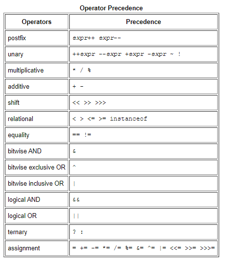
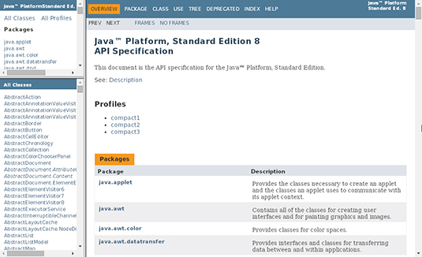
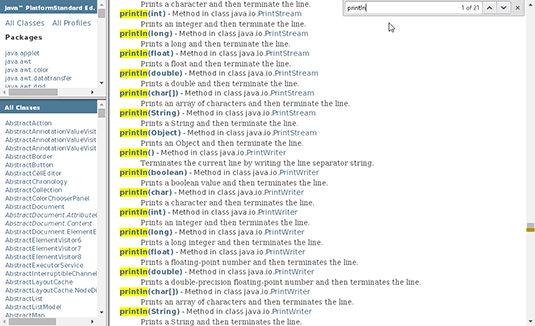

# Java Basics

## Variables

A variable is a container which holds the value while the Java program is executed. A variable is assigned with a data type. Variable is a name of memory location. There are three types of variables in java: local, instance and static.

- Instance Variables: variables defined in a class, but outside the body of methods. The declaration of an instance variable is similar to the declaration of a local variable of a method, but:

1. the variable is defined inside the class, but outside all methods;
2. the variable is preceded by an access modifier (usually private);
3. the variable is always initialized when the object is created, either implicitly (to a default value), or explicitly by the constructor (see later

- Class Variables: any variable declared with the static modifier of which a single copy exists

- Local Variables: a variable that's declared within the body of a method. Then you can use the variable only within that method. Other methods in the class aren't even aware that the variable exists. You don't specify static on a declaration for a local variable

- Parameters: Information can be passed to methods as parameter. Parameters act as variables inside the method.
Parameters are specified after the method name, inside the parentheses. You can add as many parameters as you want, just separate them with a comma.

## Operators

## Expressions, Statements, and Blocks

- Expressions:
An expression is a construct made up of variables, operators, and method invocations, which are constructed according to the syntax of the language, that evaluates to a single value. You've already seen examples of expressions, illustrated in bold below:

int cadence = 0;
anArray[0] = 100;
System.out.println("Element 1 at index 0: " + anArray[0]);

int result = 1 + 2; // result is now 3
if (value1 == value2) 
 System.out.println("value1 == value2");

- Statements: 
Statements are roughly equivalent to sentences in natural languages. A statement forms a complete unit of execution. The following types of expressions can be made into a statement by terminating the expression with a semicolon (;).

1. Assignment expressions
2. Any use of ++ or --
3. Method invocations
4. Object creation expressions

- Blocks :
A block is a group of zero or more statements between balanced braces and can be used anywhere a single statement is allowed. The following example, BlockDemo, illustrates the use of blocks:

class BlockDemo {
     public static void main(String[] args) {
          boolean condition = true;
          if (condition) { // begin block 1
               System.out.println("Condition is true.");
          } // end block one
          else { // begin block 2
               System.out.println("Condition is false.");
          } // end block 2
     }
}

# What does it mean to compile code?

Compiling is the transformation from Source Code (human readable) into machine code (computer executable). ... A compiler takes the recipe (code) for a new program (written in a high level language) and transforms this Code into a new language (Machine Language) that can be understood by the computer itself.

## Making Sense of Java’s API Documentation

- Using the index
1. Visit [Java™](https://docs.oracle.com/javase/8/docs/api//)

2. Click the INDEX link at the top of the page to open the index 

A list of letters is near the top of the index . Click the P link to go to the section with println in it.

3. In the P section, do a search for println to find the println entries.

4. Pick one of the println entries.

 

5. Click the link for the entry that you’ve chosen.

## To learn more you can [click here](https://www.dummies.com/programming/java/making-sense-of-javas-api-documentation/)

