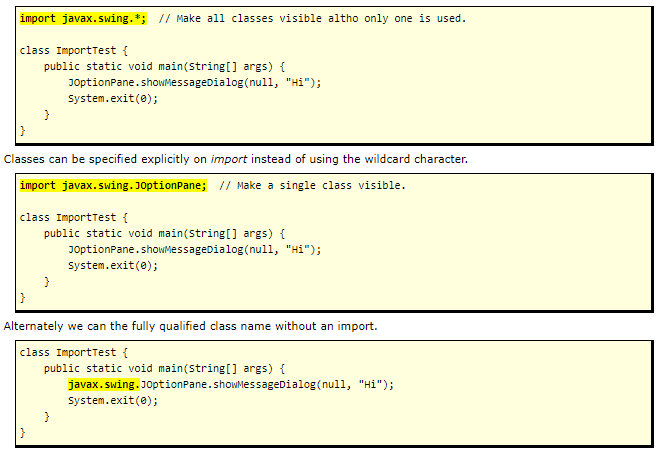
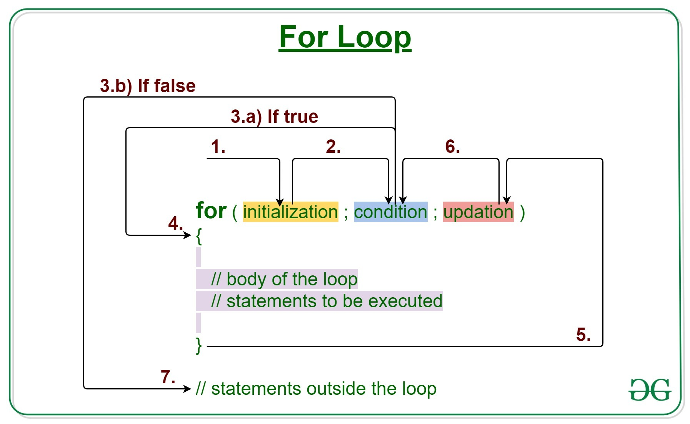

# Packages and Import

(Package = directory). Java classes can be grouped together in packages. A package name is the same as the directory (folder) name which contains the .java files. You declare packages when you define your Java program, and you name the packages you want to use from other libraries in an import statement

## Package declaration syntax

The statement order is as follows. Comments can go anywhere:

1. Package statment (optional).
2. Imports (optional).
3. Class or interface definitions.

## Imports: three options

## NetBeans creates packages by default

- The project name is used as the default package name, but you can change it.
- A directory / folder is created with this project name. This directory name is the name of your package.
- A package declaration is automatically inserted into each new source file it creates.
- When you build a main project, the double-clickable .jar file uses this project/package/directory name.

# A Guide to Java Loops

## Intro to Loops
In programming languages, looping is a feature which facilitates the execution of a set of instructions until the controlling Boolean-expression evaluates to false.
Java provides different types of loops to fit any programming need. Each loop has its own purpose and a suitable use case to serve.

**Here are the types of loops that we can find in Java:**

1. Simple for loop
2. Enhanced for-each loop
3. While loop
4. Do-While loop

## for loop

## while loop

