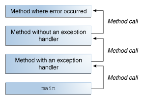
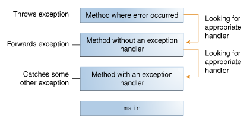

# Primitives vs. Objects

|    |      |     |
|----|-----|-----|
|Properties|	Primitive data types|	Objects|
Origin|	Pre-defined data types|	User-defined data types|
Stored structure|	Stored in a stack|	Reference variable is stored in stack and the original object is stored in heap|
When copied	|Two different variables is created along with different assignment(only values are same)|	Two reference variable is created but both are pointing to the same object on the heap|
When changes are made in the copied variable|	Change does not reflect in the original ones.|	Changes reflected in the original ones.|
Default value|	Primitive datatypes do not have null as default value	|The default value for the reference variable is null|
Example|	byte, short, int, long, float, double, char, boolean|	array, string class, interface etc.|
|   |    |  |

## What Is an Exception?

Definition: An exception is an event, which occurs during the execution of a program, that disrupts the normal flow of the program's instructions.

- The call stack: 

- Searching the call stack for the exception handler:

## The Catch or Specify Requirement

Valid Java programming language code must honor the Catch or Specify Requirement. This means that code that might throw certain exceptions must be enclosed by either of the following:

A try statement that catches the exception. The try must provide a handler for the exception, as described in Catching and Handling Exceptions.
A method that specifies that it can throw the exception. The method must provide a throws clause that lists the exception, as described in Specifying the Exceptions Thrown by a Method.
Code that fails to honor the Catch or Specify Requirement will not compile.
