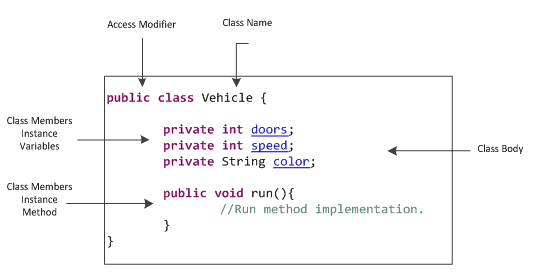
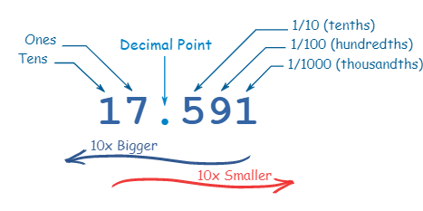
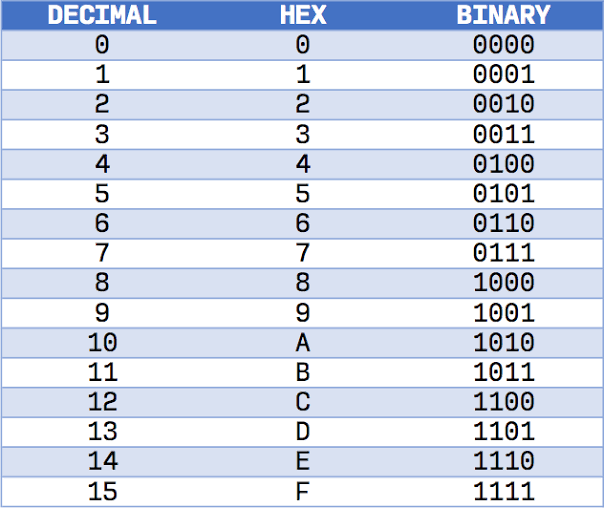

## Objects

- Software objects are conceptually similar to real-world objects: they too consist of state and related behavior.
- An object stores its state in fields (variables in some programming languages) and exposes its behavior through methods (functions in some programming languages).
- Hiding internal state and requiring all interaction to be performed through an object's methods is known as data encapsulation
- Bundling code into individual software objects provides a number of benefits, including:

1. Modularity: The source code for an object can be written and maintained independently of the source code for other objects

2. Information-hiding: By interacting only with an object's methods, the details of its internal implementation remain hidden from the outside world.

3. Code re-use: If an object already exists (perhaps written by another software developer), you can use that object in your program

4. Pluggability and debugging ease: If a particular object turns out to be problematic, you can simply remove it from your application and plug in a different object as its replacement

## Classes

- A class is the blueprint from which individual objects are created.

- class does not contain a main method that's because it's not a complete application; it's just the blueprint for bicycles that might be used in an application

## Inheritance

- Object-oriented programming allows classes to inherit commonly used state and behavior from other classes.

- The syntax for creating a subclass is simple. At the beginning of your class declaration, use the extends keyword, followed by the name of the class to inherit from.

## Decimals

- Every digit in a decimal number has a "position", and the decimal point helps us to know which position is which:
decimal

- Every position further to the left is 10 times bigger, and every position further to the right is 10 times smaller.

- decimal number system it also called big10 system, because it based on number 10

