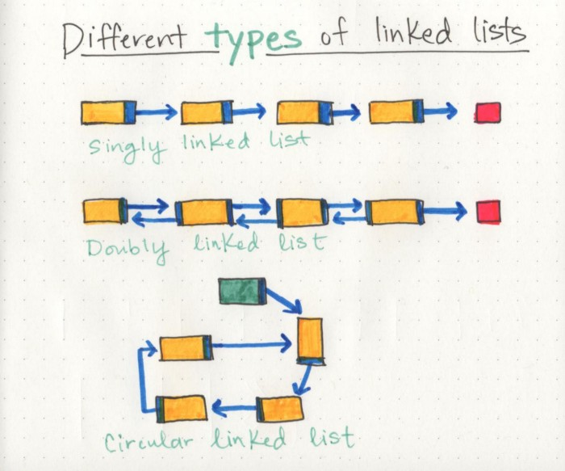

# Linked List

## Add a node after a given value in these steps:

If you want to add a node after a given value, follow these steps:

- add a current node that points at the current node and assign it to the head.
- create a new node for the value
- then by using while loop and current.next loop through the linked list
- create a condition to check if the current node is equal to the value
- first add a reference for the new node to the current node.next
- then change the reference for the current node to the new node

## Big O

Big O Notation is a method of evaluating an algorithm's performance . It's a means of expressing how long a function, operation, or algorithm takes to perform based on the number of elements we provide to it . An O(1) function runs in constant time, which means that no matter how huge our input is, our algorithm will always require the same amount of time and memory to run.

- time: O(n) (worse case) the node which has the value that searches for it is last

- space: O(1) This because there is no additional space being used

## Memory management

- The biggest differentiator between arrays and linked lists is the way that they use memory in our machines.

- When an array is created , it needs a certain amount of memory(all in one place ). On the other hand, when a linked list is born, it doesn’t need bytes of memory all in one place. One byte could live somewhere, while the next byte could be stored in another place in memory altogether!