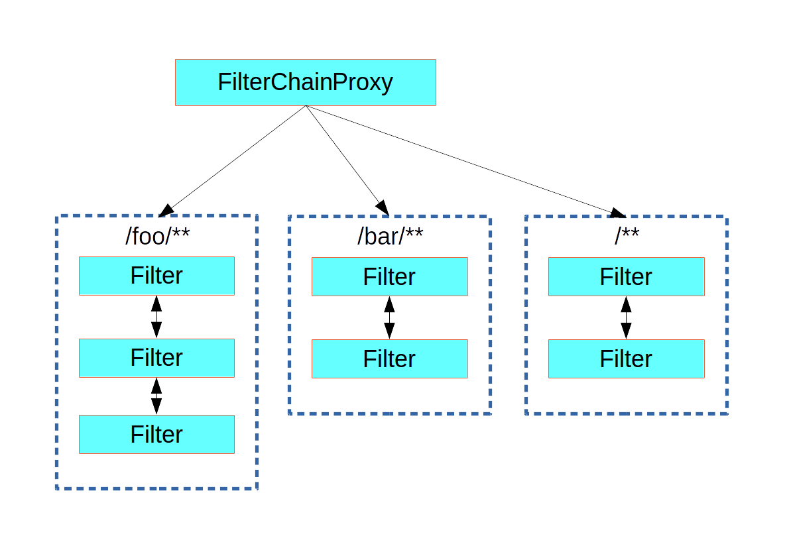

# Spring Security Architecture

## Authentication and Access Control

- Authentication
The main strategy interface for authentication is AuthenticationManager, which has only one method: 

public interface AuthenticationManager {

  Authentication authenticate(Authentication authentication)
    throws AuthenticationException;
}

An AuthenticationManager can do one of 3 things in its authenticate() method:

1. Return an Authentication (normally with authenticated=true) if it can verify that the input represents a valid principal.

2. Throw an AuthenticationException if it believes that the input represents an invalid principal.

3. Return null if it cannot decide.

AuthenticationException is a runtime exception. It is usually handled by an application in a generic way, depending on the style or purpose of the application. In other words, user code is not normally expected to catch and handle it. For example, a web UI might render a page that says that the authentication failed, and a backend HTTP service might send a 401 response, with or without a WWW-Authenticate header depending on the context.

The most commonly used implementation of AuthenticationManager is ProviderManager, which delegates to a chain of AuthenticationProvider instances. An AuthenticationProvider is a bit like an AuthenticationManager, but it has an extra method to allow the caller to query whether it supports a given Authentication type:

public interface AuthenticationProvider {

	Authentication authenticate(Authentication authentication)
			throws AuthenticationException;

	boolean supports(Class<?> authentication);
}

## Customizing Authentication Managers

Spring Security provides some configuration helpers to quickly get common authentication manager features set up in your application. The most commonly used helper is the AuthenticationManagerBuilder, which is great for setting up in-memory, JDBC, or LDAP user details or for adding a custom UserDetailsService. The following example shows an application that configures the global (parent) AuthenticationManager:

@Configuration
public class ApplicationSecurity extends WebSecurityConfigurerAdapter {

   ... // web stuff here

  @Autowired
  public void initialize(AuthenticationManagerBuilder builder, DataSource dataSource) {
    builder.jdbcAuthentication().dataSource(dataSource).withUser("dave")
      .password("secret").roles("USER");
  }

}

## Authorization or Access Control

Once authentication is successful, we can move on to authorization, and the core strategy here is AccessDecisionManager. There are three implementations provided by the framework and all three delegate to a chain of AccessDecisionVoter instances, a bit like the ProviderManager delegates to AuthenticationProviders.

An AccessDecisionVoter considers an Authentication (representing a principal) and a secure Object, which has been decorated with ConfigAttributes:

boolean supports(ConfigAttribute attribute);

boolean supports(Class<?> clazz);

int vote(Authentication authentication, S object,
        Collection<ConfigAttribute> attributes);

## Web Security

Spring Security in the web tier (for UIs and HTTP back ends) is based on Servlet Filters, so it is helpful to first look at the role of Filters generally. The following picture shows the typical layering of the handlers for a single HTTP request.

- Spring Security is a single physical Filter but delegates processing to a chain of internal filters

- The Spring Security FilterChainProxy dispatches requests to the first chain that matches.

## THIS LINK FOR [Spring Auth Cheat Sheet](https://github.com/codefellows/seattle-java-401d2/blob/master/SpringAuthCheatSheet.md)

