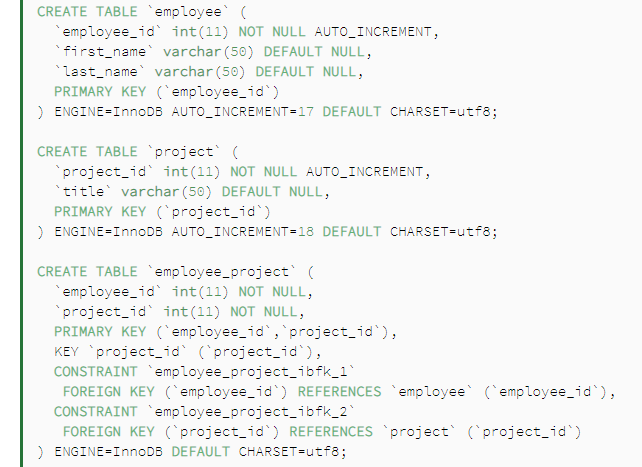

#  Web App Security

## Web App Security

- Web application security is a central component of any web-based business.
- The global nature of the Internet exposes web properties to attack from different locations and various levels of scale and complexity.
- Web application security deals specifically with the security surrounding websites, web applications and web services such as APIs.

## Many to many relationships

@ManyToMany annotation can be used for specifying this type of relationships in Hibernate.

Entity Relationship Diagram which shows the many-to-many association between two entities

Let's start with a simple Entity Relationship which is the many-to-many association between two entities employee and project:

- employee can be assigned to multiple projects
- project may have multiple employees working for it
- many-to-many association between the two.

## Database Setup
Let's assume we have an already created database with the name spring_hibernate_many_to_many.

We also need to create the employee and project tables along with the employee_project join table with employee_id and project_id as foreign keys:

## The Model Classes

The model classes Employee and Project need to be created with JPA annotations:

@Entity
@Table(name = "Employee")
public class Employee {
    // ...

    @ManyToMany(cascade = { CascadeType.ALL })
    @JoinTable(
        name = "Employee_Project",
        joinColumns = { @JoinColumn(name = "employee_id") },
        inverseJoinColumns = { @JoinColumn(name = "project_id") }
    )
    Set<Project> projects = new HashSet<>();

    // standard constructor/getters/setters
}

# Security: a humorous overview

It's almost as though security researchers have issues with public relations since they make it impossible to do everything you want on a website. Security experts are always working to address security vulnerabilities and improve people's ability to establish more secure passwords. Any password may be hacked. Using the same password for everything isn't a smart idea.

Security researchers utilize the threat model to prevent security breaches by instructing individuals on how to create passwords and where security risks originate, although security breaches don't always come from apparent sources. There is no such thing as a flawless security system, and any security system, no matter how robust, will be breached at some point. To make things more safe, information flow control and security labels are employed. The majority of individuals do not want to pay a lot of money merely to make their system safer. As a result, security researchers should focus on what will happen when I properly construct my software, rather than what may happen.