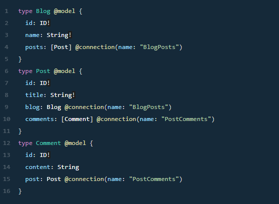

# Intro to Serverless

## What is Serverless?

Serverless is a cloud computing execution model where the cloud provider dynamically manages the allocation and provisioning of servers. A serverless application runs in stateless compute containers that are event-triggered, ephemeral (may last for one invocation), and fully managed by the cloud provider. Pricing is based on the number of executions rather than pre-purchased compute capacity, isn’t it the ideal framework for that project you have been planning since a long time? Well, go ahead do it.

Serverless applications are event-driven cloud-based systems where application development rely solely on a combination of third-party services, client-side logic and cloud-hosted remote procedure calls (Functions as a Service).

- Here are some of the currently available cloud services:

1. AWS Lambda
2. Google Cloud Functions
3. Azure Functions
4. IBM OpenWhisk
5. Alibaba Function Compute
6. Iron Functions
7. Auth0 Webtask
8. Oracle Fn Project
9. Kubeless

# AWS Amplify Kool-Aid

## How it works

AWS Amplify is a set of purpose-built tools and services that makes it quick and easy for front-end web and mobile developers build full-stack applications on AWS, with the flexibility to leverage the breadth of AWS services to further customize applications. Amplify supports popular languages, frameworks, and platforms, including JavaScript, React, Angular, Vue, and Next.js for web apps and Android, iOS, React Native, Ionic, and Flutter for mobile apps.

# API (GRAPHQL)

The GraphQL Transform provides a simple to use abstraction that helps you quickly create backends for your web and mobile applications on AWS. With the GraphQL Transform, you define your application's data model using the GraphQL Schema Definition Language (SDL) and the library handles converting your SDL definition into a set of fully descriptive AWS CloudFormation templates that implement your data model.

## Create a GraphQL API

1. Navigate into the root of a JavaScript, iOS, or Android project and run: amplify init

2. Follow the wizard to create a new app. After finishing the wizard run: amplify add api

3. Select the following options:

- Select GraphQL
- When asked if you have a schema, say No
- Select one of the default samples; you can change this later
- Choose to edit the schema and it will open the new schema.graphql in your editor

4. You can leave the sample as is or try this schema.

5. Once you are happy with your schema, save the file and hit enter in your terminal window. if no error messages are thrown this means the transformation was successful and you can deploy your new API. : amplify push