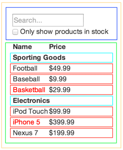
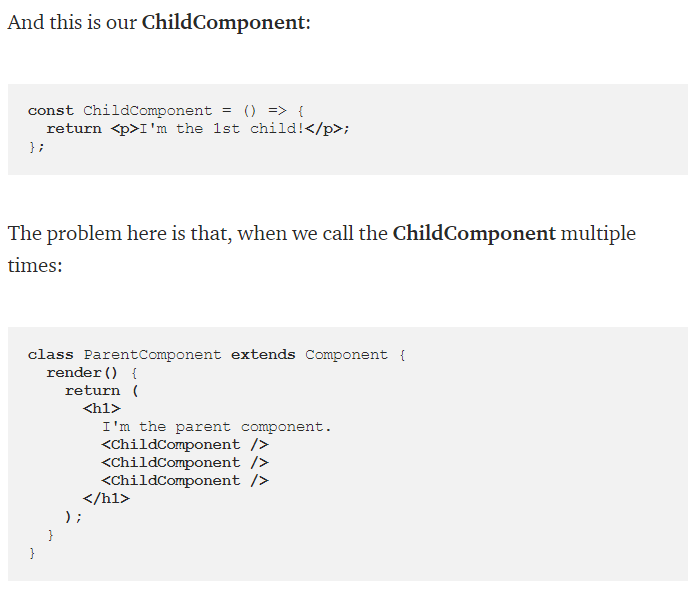
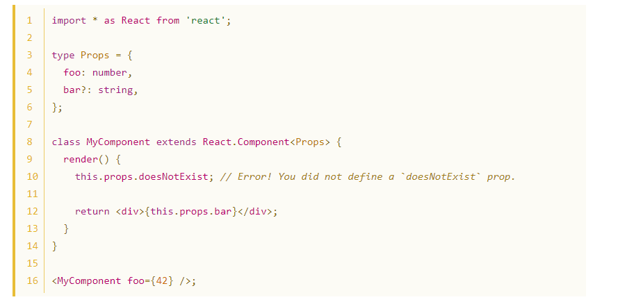

# Component Based Architecture

- ## What is a component?
A component is a modular, portable, replaceable, and reusable set of well-defined functionality that encapsulates its implementation and exporting it as a higher-level interface.

A component is a software object, intended to interact with other components, encapsulating certain functionality or a set of functionalities. It has an obviously defined interface and conforms to a recommended behavior common to all components within an architecture.

A software component can be defined as a unit of composition with a contractually specified interface and explicit context dependencies only. That is, a software component can be deployed independently and is subject to composition by third parties.

- ## What are the charactistics of a component?

1. Reusability − Components are usually designed to be reused in different situations in different applications. However, some components may be designed for a specific task.

2. Replaceable − Components may be freely substituted with other similar components.

3. Not context specific − Components are designed to operate in different environments and contexts.

4. Extensible − A component can be extended from existing components to provide new behavior.

5. Encapsulated − A A component depicts the interfaces, which allow the caller to use its functionality, and do not expose details of the internal processes or any internal variables or state.

6. Independent − Components are designed to have minimal dependencies on other components.

- ## What are the advantages of using component based architecture?

1. Ease of deployment − As new compatible versions become available, it is easier to replace existing versions with no impact on the other components or the system as a whole.

2. Reduced cost − The use of third-party components allows you to spread the cost of development and maintenance.

3. Ease of development − Components implement well-known interfaces to provide defined functionality, allowing development without impacting other parts of the system.

4. Reusable − The use of reusable components means that they can be used to spread the development and maintenance cost across several applications or systems.

5. Modification of technical complexity − A component modifies the complexity through the use of a component container and its services.

6. Reliability − The overall system reliability increases since the reliability of each individual component enhances the reliability of the whole system via reuse.

7. System maintenance and evolution − Easy to change and update the implementation without affecting the rest of the system.

8. Independent − Independency and flexible connectivity of components. Independent development of components by different group in parallel. Productivity for the software development and future software development.

# What is Props and How to Use it in React

- ## What is props short for?

React is a component-based library which divides the UI into little reusable pieces. In some cases, those components need to communicate (send data to each other) and the way to pass data between components is by using props.
*props* is a special keyword in React, which stands for properties and is being used for passing data from one component to another.

- ## How are props used in React?

I will be explaining how to use Props step by step:

**Firstly**, define an attribute and its value(data)

**Then** pass it to child component(s) by using Props
**Finally**, render the Props Data

- ## What is the flow of props?

Adding Flow types to your React components is incredibly powerful. After typing your component, Flow will statically ensure that you are using the component in the way it was designed to be used.

Early in React’s history the library provided PropTypes which performed basic runtime checks. Flow is much more powerful as it can tell you when you are misusing a component without running your code.

There are some Babel plugins which will generate PropTypes from Flow types such as babel-plugin-react-flow-props-to-prop-types if you want both static and runtime checks.

