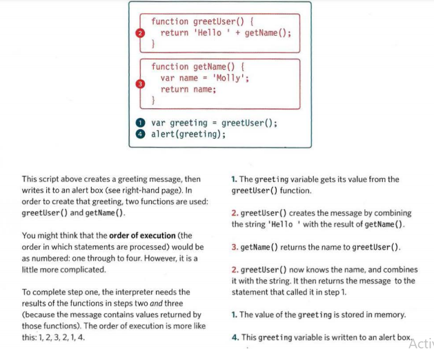
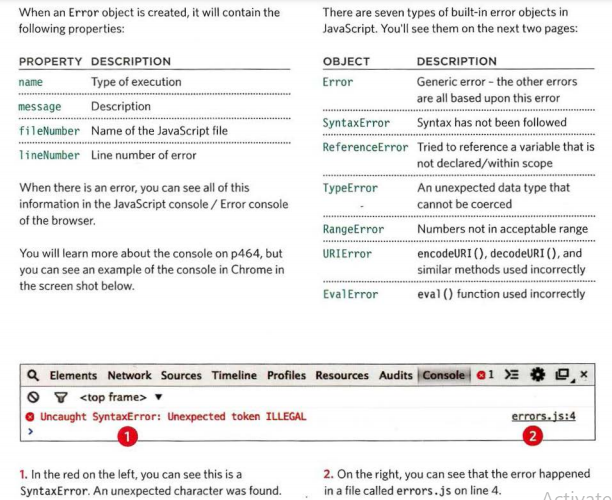

# ERROR HANDLING & DEBUGGING 

## ORDER OF EXECUTION

To find the source of an error, it helps to know how scripts are processed. The order in which statements are executed can be complex; some tasks cannot complete until another statement or function has been run: 

## EXECUT.ION CONTEXTS 

- EXECUTION CONTEXT
JavaScript Hello Molly Every statement in a script lives in one of three execution contexts:

1. GLOBAL CONTEXT
Code that is in the script, but not in a function. There is only one global context in any page.

2. FUNCTION CONTEXT
Code that is being run within a function.Each function has its own function context.

3. EVAL CONTEXT (NOT SHOWN)
Text is executed like code in an internal function
called eval ()

- VARIABLE SCOPE
The first two execution contexts correspond with the notion of scope :

1. GLOBAL SCOPE
If a variable is declared outside a function, it can be used anywhere because it has global scope. If you do not use the var keyword when creating a variable, it is placed in global scope.

2. FUNCTION-LEVEL SCOPE
When a variable is declared within a function, it can only be used within that function. This is because it has function-level scope

## ERROR OBJECTS 

Error objects can help you find where your mistakes are and browsers have tools to help you read them. 

## Summary :

- If you understand execution contexts (which have two stages) and stacks, you are more likely to find the error in your code.

- Debugging is the process of finding errors. It involves a process of deduction.

- The console helps narrow down the area in which the error is located, so you can try to find the exact error.

- JavaScript has 7 different types of errors. Each creates its own error object, which can tell you its line number and gives a description of the error.

- If you know that you may get an error, you can handle it gracefully using the try, catch, finally statements. Use them to give your users helpful feedback. 
