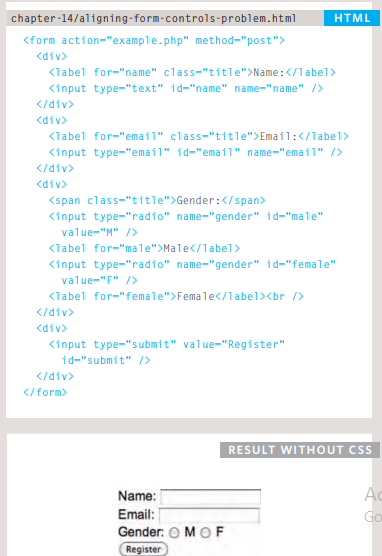
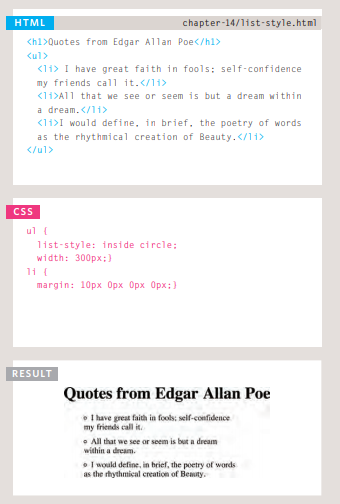
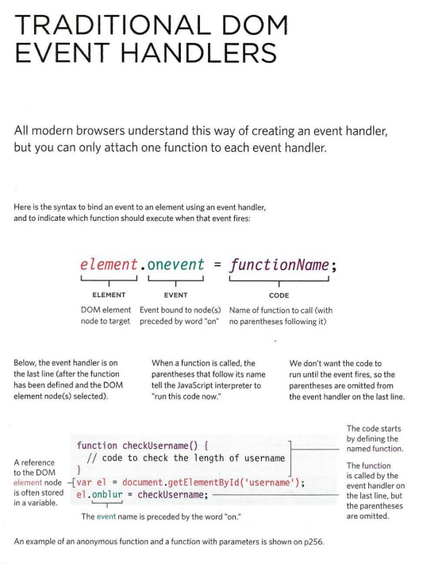

# Forms

HTML borrows the concept of a form to refer to different elements that allow you to collect information from visitors to your site.

- The best known form on the web is probably the search box that sits right in the middle of Google's homepage.

## Form Controls

1. ADDING Text
2. Making Choices
3. Submitting Forms
4. Uploading Files

- Example form :

## Summary

1. Whenever you want to collect information from visitors you will need a form, which lives inside a
< form > element.
2. Information from a form is sent in name/value pairs.
3. Each form control is given a name, and the text the user types in or the values of the options they select are sent to the server.
4. HTML5 introduces new form elements which make it easier for visitors to fill in forms.

# LISTS , TABLES AND FORMS

- In addition to the CSS properties covered in other chapters which work with the contents of all elements, there are several others that are specifically used to control the appearance of lists, tables, and forms.
- List markers can be given different appearances using the list-style-type and list-style image
properties.
- Table cells can have different borders and spacing in different browsers, but there are properties you can use to control them and make them more consistent.
- Forms are easier to use if the form controls are vertically aligned using CSS.
- Forms benefit from styles that make them feel more interactive.

- list example:

# EVENTS

- EVENT LISTENERS
Event listeners are a more recent approach to handling events. They can deal with more than one function at a time but they are not supported in older browsers

the syntax :

 

 1. Events are the browser's way of indicating when something has happened (such as when a page has finished loading or a button has been clicked).
 2. Binding is the process of stating which event you are waiting to happen, and which element you are waiting for that event to happen upon.
 3. When an event occurs on an element, it can trigger a JavaScript function. When this function then changes the web page in some way, it feels interactive because it has responded to the user.
 4. You can use event delegation to monitor for events that happen on all of the children of an element.
 5. The most commonly used events are W3C DOM events, although there are others in the HTMLS specification as well as browser-specific events.
